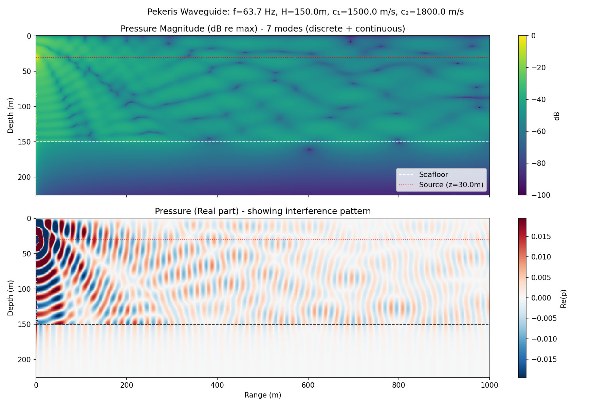

# pekeris-waveguide-solver

Python script for calculating the acoustic pressure (and gradients) in a Pekeris waveguide, which is a canonical simplistic model of a shallow-water acoustic waveguide.

The Python script `pekeris.py` was generated from original Fortran/C code (written around 2010 as part of my academic research) with assistance from Claude Code.  The original Fortran/C source code is also included for reference.

When the Fortran implementation was originally written, its output was verified against a finite-element model (*hp2d*, developed by the research group of Leszek Demkowicz at UT Austin).  The script `pekeris_fem.py` sets up a similar FEM model using FEniCSx and Gmsh.

Claude Code was used extensively to generate the Python code in this repository.  The `claude-code-logs` folder contains logs of the prompting / interactions with Claude Code.




## Available scripts:
- `pekeris.py`: implementation of closed-form solution
- `pekeris_gmsh.py`: finite-element mesh generation
- `pekeris_fem.py`: dolfinx finite-element model and comparison routine
- `verify_lloyds_mirror.py`: verification of finite-element model on Lloyd's mirror problem

  
## Python dependencies
- numpy
- scipy (Brent solver, Bessel functions, adaptive integration)
- matplotlib

### Optional FEM dependencies

FEniCSx is required for the finite-element model `pekeris_fem.py`.  Follow the installation instructions on the [project website](https://fenicsproject.org/download/).  In particular, you need to follow the instructions for enabling complex number support.  

To install under Ubuntu, I did the following:

1. Install FEniCSx packages via apt (this will install to the Ubuntu system Python environment):
```
sudo add-apt-repository ppa:fenics-packages/fenics
sudo apt update
sudo apt install fenicsx
```

2. Install complex number support package:
```
sudo apt install python3-dolfinx-complex
```

3. Set `PETSC_DIR` environment variable (added to my `.bashrc`):
```
export PETSC_DIR=/usr/lib/petscdir/petsc-complex
```

If you want to create a Python virtual environment for use with this project after following the above steps, you should use the `--system-site-packages` flag otherwise the FEniCSx packages will not be available from within the venv:
```
python3 -m venv venv --system-site-packages
```


## Usage
Running the script with no arguments will calculate the pressure field for an example waveguide and display the results:
```
python pekeris.py
```

A few command-line options are available:
```
python pekeris.py --help
```
